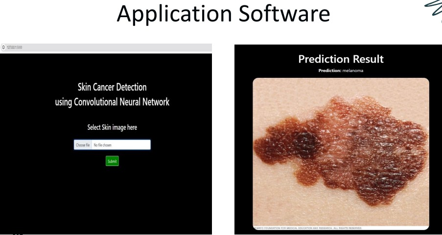
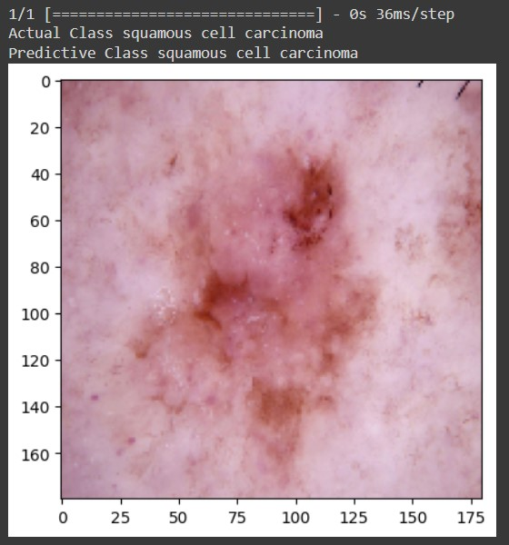

# Skin-Cancer-Detection-Application
Capstone project
# Skin Cancer Detection Using Convolutional Neural Network

This is my final year capstone project of master's in Mathematics and Data Science the project involves detecting and classifying 9 types of skin cancer using deep learning techniques. It leverages advanced image processing and convolutional neural networks (CNNs) to achieve high accuracy in skin cancer diagnosis, providing a valuable tool for early detection and treatment planning.




## Table of Contents

- [Introduction](#introduction)
- [Features](#features)
- [Dataset](#dataset)
- [Model Architecture](#model-architecture)
- [Installation](#installation)
- [Test Example](#test-example)
- [Challenges](#challenges)
- [License](#license)

## Introduction

Skin cancer is one of the most common cancers worldwide. Early detection and accurate classification are crucial for effective treatment. This project aims to automate the classification of skin lesions into nine categories using deep learning, which can significantly aid dermatologists in the diagnostic process.

## Features

- **Multi-Class Classification**: Detect and classify 9 different types of skin cancer.
- **Preprocessing**: Image normalization and augmentation for better model robustness.
- **Transfer Learning**: Utilizes pre-trained CNN models like VGG16, ResNet50, and InceptionV3 for improved accuracy.
- **Evaluation Metrics**: Comprehensive performance metrics including accuracy, precision, recall, and F1-score.

## Dataset <a href="https://www.kaggle.com/datasets/nodoubttome/skin-cancer9-classesisic/" target="_blank">link</a>
The dataset used for this project includes thousands of dermoscopic images classified into 9 categories:
1. Actinic Keratoses
2. Basal Cell Carcinoma
3. Dermatofibroma
4. Melanoma
5. Nevus
6. Pigmented benign keratosis
7. Seborrheic keratosis
8. Squamous Cell Carcinoma
9. Vascular lesion


## Model Architecture

The model architecture is based on base cnn model. I also leverage transfer learning with pre-trained models such as VGG16, ResNet50, and InceptionV3 to improve classification accuracy.

## Installation

1. Clone the repository:
    ```sh
    git clone https://github.com/gaurav0199/Skin-Cancer-Detection-App.git
    cd Skin-Cancer-Detection-App
    ```

2. Install the required packages:
    ```sh
    pip install -r requirements.txt
    ```
3. Run Application
    ```sh
    python app.py
    ```
<br>


## Test Example
```sh
image_path = os.path.join(test_data, class_names[7], 'ISIC_0024372.jpg')
test_image = glob(image_path)
test_image = load_img(test_image[-1],target_size=(180,180,3))
plt.imshow(test_image)
plt.grid(False)
pred = best_model.predict(np.expand_dims(test_image,axis=0))
pred = np.argmax(pred)
pred_class = class_names[pred]
print("Actual Class "+ class_names[7]+'\n'+"Predictive Class "+pred_class )
```
#### Test Result


## Challenges

- **Class Imbalance**: In the dataset some classes of skin lesions are underrepresented, resulting in imbalanced learning. Class imbalance can affect model performance, this disparity can lead to biased learning and making it difficult to accurately identify and classify less common skin lesions.
- **Data Variability**: High variability in image quality and lesion appearance can affect model performance.
- **Generalization**: Models trained on specific datasets may not generalize well to images from different sources or populations.
- **Interpretability**: Understanding the model's decision-making process is crucial for clinical acceptance and trust.
- **Real-Time Processing**: Ensuring the model can process images in real-time while maintaining accuracy is a significant challenge.

#### Challenges with Traditional Methods
- **Reduction in Diagnostic Costs**: Automated systems can handle large volumes of images quickly and accurately, reducing the need for multiple visits to specialists, which can be costly.
- **Time-Consuming**: Manual examination and diagnosis are time-consuming, delaying treatment.
- **Limited Accessibility**: Access to expert dermatologists is limited in many regions, hindering early diagnosis.
- **Scalability**: Traditional methods struggle to scale effectively to handle large volumes of patients or images.


## License
[ MIT license ]

